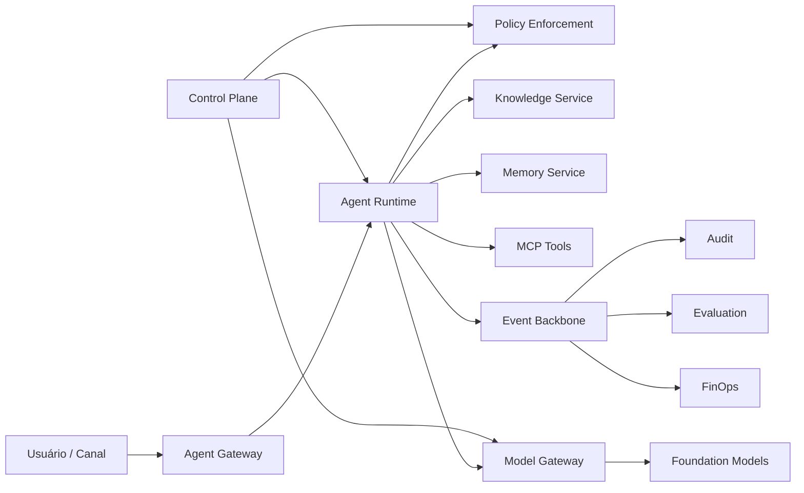

# Enterprise AI Platform — Book e Arquitetura de Referência

[](https://github.com/leandrosflora/enterprise-ai-platform-demo-arch/actions/workflows/quality.yml)
[](https://github.com/leandrosflora/enterprise-ai-platform-demo-arch/actions/workflows/docs.yml)
[](https://github.com/leandrosflora/enterprise-ai-platform-demo-arch/actions/workflows/book.yml)

Um **book executável** sobre como projetar, governar, implantar e operar uma plataforma corporativa de IA com agentes, RAG, memória, MCP, governança, evaluation, observabilidade, segurança e FinOps.

O repositório combina três camadas:

- **Book:** narrativa, decisões, operating model, estudos de caso e checklists;
- **Arquitetura de referência:** princípios, C4, ADRs, contratos, policies e runbooks;
- **Vertical slice executável:** demo mínima de cadastro, governança, publicação e invocação de agente.

## Leia como livro

Comece em [Enterprise AI Platform Book](docs/book/index.md).

| Perfil | Caminho recomendado |
|---|---|
| Executivo | [Por que uma AI Platform?](docs/book/01-why-ai-platform.md) → [Capability Map](docs/book/02-capability-map.md) → [Roadmap](docs/book/07-adoption-roadmap.md) |
| Arquiteto | [Capability Map](docs/book/02-capability-map.md) → [Operating Model](docs/book/03-operating-model.md) → [Decision Guides](docs/book/06-decision-guides.md) |
| Product squad | [Lifecycle](docs/book/04-agent-lifecycle.md) → [Caso RAG](docs/book/05-case-study-document-agent.md) → [Checklists](docs/book/08-production-checklists.md) |
| Segurança e LGPD | [Operating Model](docs/book/03-operating-model.md) → [Lifecycle](docs/book/04-agent-lifecycle.md) → [Segurança de RAG e memória](docs/security/rag-memory-security.md) |
| SRE e FinOps | [Capability Map](docs/book/02-capability-map.md) → [Roadmap](docs/book/07-adoption-roadmap.md) → [Checklists](docs/book/08-production-checklists.md) |

A pipeline `book.yml` gera automaticamente o manuscrito consolidado, o PDF e previews renderizados como artifact do GitHub Actions.

## Visão da plataforma



## Quickstart da vertical slice

### Pré-requisitos

- Docker Engine 24+
- Docker Compose v2
- `curl`

### Subir a demo

```bash
cd samples/vertical-slice
docker compose up --build
```

Em outro terminal:

```bash
bash scripts/demo.sh
```

A demo percorre:

1. cadastro de um agente;
2. submissão e aprovação com segregação de funções;
3. publicação da versão;
4. ingestão e retrieval seguros;
5. invocação com resposta citada;
6. memória com controles de TTL, consentimento e isolamento;
7. eventos, métricas e traces.

### Endpoints locais

| Recurso | URL |
|---|---|
| API | `http://localhost:8080` |
| Swagger | `http://localhost:8080/docs` |
| Jaeger | `http://localhost:16686` |
| Prometheus | `http://localhost:9090` |
| Redpanda Console | `http://localhost:8081` |

## Estado dos artefatos

| Área | Status | Fonte principal |
|---|---|---|
| Book | narrativa e checklists versionados | `docs/book/` |
| APIs HTTP | implementável e validada em CI | `docs/contracts/openapi.yaml` |
| Eventos Kafka | implementável e validada em CI | `docs/contracts/async-api.yaml` |
| Policies | executáveis e validadas em CI | `policies/` |
| C4 | PlantUML validado em CI | `docs/architecture/diagrams/` |
| Governança e risco | referência operacional | `docs/governance/` |
| Segurança de RAG e memória | padrão + policy + testes negativos | `docs/security/rag-memory-security.md` |
| Observabilidade e SLOs | referência operacional | `docs/observability/` |
| Demo executável | vertical slice, não produção | `samples/vertical-slice/` |
| PDF | gerado automaticamente pelo workflow Book | `.github/workflows/book.yml` |

## Mapa da documentação técnica

### Arquitetura

- [Princípios arquiteturais](docs/architecture/principles/principles.md)
- [Requisitos não funcionais](docs/architecture/non-functional-requirements.md)
- [Control plane e data plane](docs/architecture/control-plane-data-plane.md)
- [Modelo C4](docs/architecture/diagrams/)
- [ADRs](docs/adr/)

### Domínios e serviços

- [Domínios](docs/domains/)
- [Serviços](docs/services/)
- [Model Gateway](docs/services/model-gateway.md)
- [Knowledge Service](docs/services/knowledge-service.md)
- [Memory Service](docs/services/memory-service.md)

### Contratos

- [OpenAPI](docs/contracts/openapi.yaml)
- [AsyncAPI](docs/contracts/async-api.yaml)
- [Convenções de eventos](docs/contracts/events.md)
- [Contratos MCP](docs/contracts/mcp-contracts.md)
- [Data stores](docs/contracts/data-stores.md)

### Governança, segurança e operação

- [AI Risk Framework](docs/governance/ai-risk-framework.md)
- [Autorização](docs/security/authorization.md)
- [Segurança de RAG e memória](docs/security/rag-memory-security.md)
- [Threat Model](docs/security/threat-model.md)
- [Tracing e SLOs](docs/observability/tracing.md)
- [Runbooks](docs/runbooks/)
- [Roadmap técnico](docs/roadmap/implementation-roadmap.md)

## Qualidade automatizada

A pipeline `quality.yml` executa:

- lint de OpenAPI e AsyncAPI;
- validações semânticas de contratos e policies;
- verificação do manifest do book;
- verificação de links e integridade documental;
- compilação dos diagramas PlantUML;
- testes da vertical slice;
- validação do Docker Compose;
- build do site MkDocs.

A pipeline `book.yml` executa:

- consolidação ordenada dos capítulos;
- exportação PDF com Pandoc e WeasyPrint;
- inspeção da estrutura do PDF;
- renderização das páginas iniciais;
- publicação do manuscrito, PDF e previews como artifact.

## Limites da demo

A vertical slice usa armazenamento em memória e respostas determinísticas. Ela prova fluxos, contratos e controles, mas não substitui implementação produtiva. Persistência, IdP corporativo, KMS, políticas de rede, alta disponibilidade, sizing e integrações reais devem seguir os artefatos de arquitetura e o contexto da organização.

## Contribuição e segurança

- [Como contribuir](CONTRIBUTING.md)
- [Política de segurança](SECURITY.md)

## Licença

MIT.
